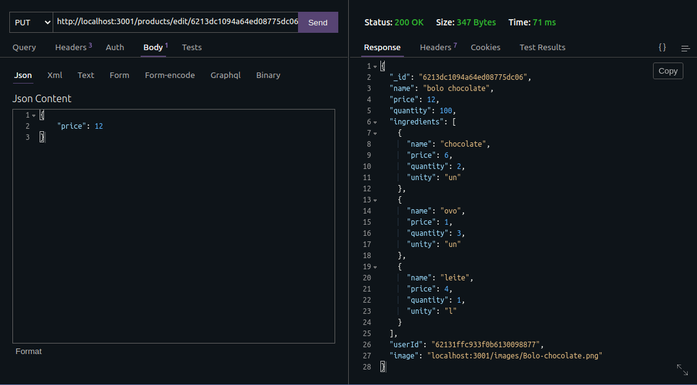

# Desafio Pro Franchising

## Sobre o projeto

Desafio Técnico para processo seletivo, este projeto consiste na implementação de um sistema de controle de estoque com um login, CRUD de produtos.

Onde feito o login e gerado um token para a autenticação do usuário, pois apenas o próprio usuário pode ver, criar, atualizar e deletar seus produtos em estoque.

No desenvolvimento foi usado a arquitetura MSC e REST.

## Tecnologias Utilizadas

#### :link: [Node.js](https://nodejs.org/en/)
#### :link: [Express](https://expressjs.com/pt-br/)
#### :link: [MongoDB](https://docs.mongodb.com/)
#### :link: [JsonWebToken](https://jwt.io/introduction)
#### :link: [Joi](https://joi.dev/api/?v=17.5.0)
#### :link: [ESLint](https://eslint.org/)
#### :link: [Multer](https://www.npmjs.com/package/multer)

## Pré-Requisitos

Este projeto Utiliza o banco de dados MongoDB, para o funcionamento é necessário ter o banco de dados em sua máquina. Para instruções sobre a instalação do banco de dados acesse [MongoDB](https://docs.mongodb.com/manual/installation/).

## Instalação

— Clone o repositório através da seguinte chave https: `https://github.com/devwelljr/desafio-pro-franchising.git`

— Instale as dependências, entrando na raiz dando `npm install`.

— Crie um arquivo de variáveis de ambiente na raiz, `.env` seguindo o arquivo `.env.example` como exemplo.

— Para rodar a aplicação de `npm run dev` na raiz.

## Como utilizar

### Login(POST): http://localhost:3001/users/login

A aplicação começa com o cliente tendo que fazer login ou se cadastrar, onde deve digitar seu `email` e sua senha para ser receber o token de `Authorization`.

### Cadastro(POST): http://localhost:3001/users/register

No cadastro para se criar uma conta o usuário precisa cadastrar seu `usuário` com no mínimo 4 carácteres, sua `senha` com no mínimo 6 carácteres e um `email` válido.
PS: O `email` é único no sistema, não sendo possível ter dois usuários com o mesmo email.

### Cadastro de produto(POST): http://localhost:3001/products/new

Apos o login, um `token JWT` e retornado, para inserir novos produtos e obrigatório está logado, passando no `header` um campo chamado `authorization` com o token.

Um novo produto deve ser passado como objeto pro body da requisição, onde se deve obrigatoriamente colocar os seguintes chaves e valores:

Exemplo:

### Inserir imagem no produto(PUT): http://localhost:3001/products/:id/image

Para inserir a imagem no produto ela deve ser nos formatos `PNG/JPG` no field `image`, com o ID do produto passado na URL.

Exemplo:

### Visualizar todos os produtos(GET): http://localhost:3001/products/myProducts

Para visualizar todos os produtos e necessário o `token JWT` no `header` com um campo chamado `authorization`.

Exemplo:

### Deletar um produto(DELETE): http://localhost:3001/products/deleteProduct/:id

Para deletar o produto e necessário o `token JWT` no `header` com um campo chamado `authorization` e o ID do produto na URL.

Exemplo:

### Atualizar um produto(PUT): http://localhost:3001/products/edit/:id

Para atualizar o produto e necessário o `token JWT` no `header` com um campo chamado `authorization`, o ID do produto na URL e o body com os campos e valores do que deseja alterar.

Exemplo:

### Relatório do custo dos ingredientes dos produtos(GET): http://localhost:3001/products/report

Para acessar o relatório de gastos com ingredientes e necessário o `token JWT` no `header` com um campo chamado `authorization`, ele ira retornar o custo de cada ingrediente dos produtos do dono.

Exemplo:

